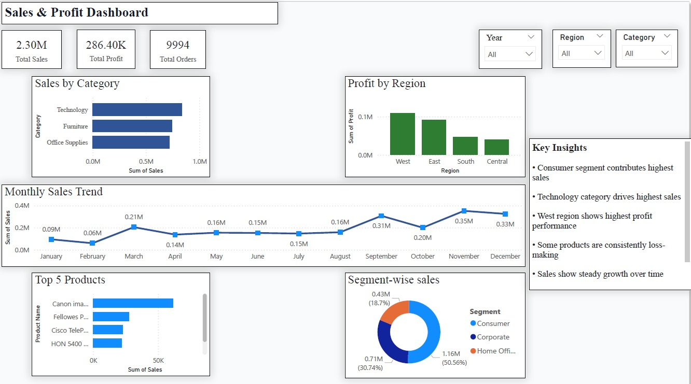

# 📊 Sales & Profit Dashboard (Power BI)

## 📌 Overview

This project analyzes sales and profit performance using an interactive Power BI dashboard.  
The goal is to identify trends, top-performing categories, and business opportunities.  
This project simulates a real-world business analysis scenario.

---

## 🛠 Tools Used
- Excel (Data Cleaning)
- SQL (Data Analysis)
- Power BI (Visualization)

---

## 📊 Dashboard Features
- KPI Cards: Total Sales, Total Profit, Total Orders  
- Sales by Category  
- Profit by Region  
- Monthly Sales Trend  
- Segment-wise Sales  
- Top 5 Products  

---

## 🔍 Key Insights
- Consumer segment contributes the highest sales  
- Technology category drives maximum revenue  
- West region shows highest profitability  
- Some products generate losses  
- Sales trend shows steady growth  

---

## 📷 Dashboard Preview

---

## 📁 Project Files
- dashboard.pbix  
- dataset.xlsx  
- sql_queries.sql  
- project_document.docx  

---

## 🎯 Conclusion
This dashboard helps businesses understand performance trends and make data-driven decisions.

---

## 👤 Author
Sirigiri Malakonda Reddy
