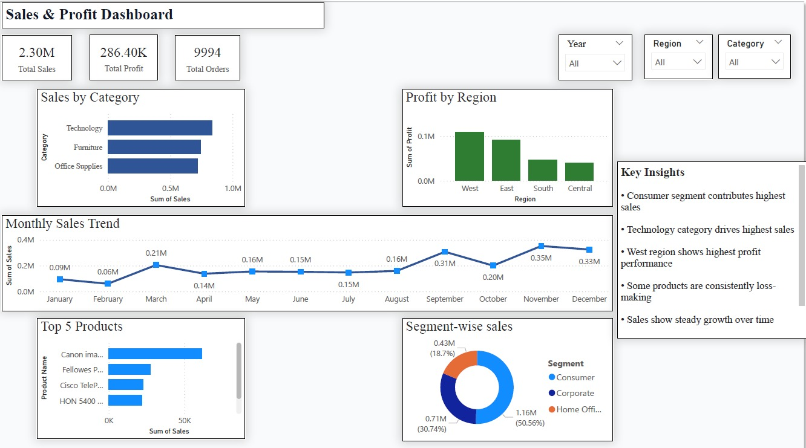

# 📊 Superstore Sales & Profit Dashboard


> An end-to-end business intelligence project analyzing sales, profit, and customer segmentation across regions and product categories — built with Excel, SQL, and Power BI.

---

## 📌 Table of Contents

- [Overview](#-overview)
- [Key Insights](#-key-insights)
- [Dashboard Preview](#-dashboard-preview)
- [Project Structure](#-project-structure)
- [Tools & Technologies](#-tools--technologies)
- [Dashboard Features](#-dashboard-features)
- [Data Pipeline](#-data-pipeline)
- [SQL Analysis](#-sql-analysis)
- [How to Run](#-how-to-run)
- [Author](#-author)

---

## 🧭 Overview

This project simulates a real-world retail business analytics scenario using the **Superstore dataset** — a commonly used benchmark dataset representing a fictional US-based retail company.

The goal is to answer business-critical questions:
- Which product categories and regions drive the most revenue?
- Where are we losing money?
- Who are our most valuable customer segments?
- How is performance trending over time?

The project covers the full data analytics workflow — from raw data cleaning in Excel, exploratory analysis in SQL, to final storytelling in an interactive Power BI dashboard.

---

## 💡 Key Insights

| # | Insight |
|---|---------|
| 1 | 🏆 **Consumer segment** generates the highest sales volume across all regions |
| 2 | 💻 **Technology** is the top revenue-driving category |
| 3 | 🌍 **West region** has the highest overall profitability |
| 4 | ⚠️ Several products in the **Furniture** category operate at a net loss |
| 5 | 📈 Sales show a consistent **upward trend** year-over-year |
| 6 | 🔻 Some high-revenue products have **negative profit margins** — a key risk area |

---

## 📷 Dashboard Preview



> *Interactive Power BI dashboard showing KPIs, category breakdown, regional profit, and monthly trends.*

---

## 📁 Project Structure

```
superstore-sales-dashboard/
│
├── 📂 data/
│   └── dataset.xlsx              # Cleaned source data (Excel)
│
├── 📂 sql/
│   └── sql_queries.sql           # All SQL queries with comments
│
├── 📂 reports/
│   └── dashboard.pbix            # Power BI dashboard file
│
├── 📂 docs/
│   └── project_document.docx     # Full project documentation
│
├── 📂 assets/
│   └── screenshot.png            # Dashboard preview image
│
└── README.md                     # You are here
```

---

## 🛠 Tools & Technologies

| Tool | Purpose |
|------|---------|
| **Microsoft Excel** | Data cleaning, formatting, and initial exploration |
| **SQL (PostgreSQL syntax)** | Data querying, aggregation, and business logic |
| **Power BI Desktop** | Interactive dashboard and data visualization |

---

## 📊 Dashboard Features

The Power BI dashboard (`reports/dashboard.pbix`) includes:

- **KPI Cards** — Total Sales, Total Profit, Total Orders at a glance
- **Sales by Category** — Bar chart comparing Furniture, Office Supplies, and Technology
- **Profit by Region** — Ranked view of the four US regions
- **Monthly Sales Trend** — Time-series line chart showing growth patterns
- **Segment-wise Sales** — Breakdown by Consumer, Corporate, and Home Office
- **Top 5 Products by Sales** — Highlights highest revenue-generating items
- **Loss-making Products** — Identifies products with negative profit

---

## 🔄 Data Pipeline

```
Raw Dataset (Excel)
      │
      ▼
Data Cleaning (Excel)
  - Remove duplicates
  - Handle nulls
  - Standardize date formats
  - Validate column types
      │
      ▼
SQL Analysis (PostgreSQL)
  - Aggregations by category, region, segment
  - Profit/loss identification
  - Top-N product queries
      │
      ▼
Power BI Dashboard
  - Import cleaned data
  - Build calculated measures
  - Design visuals and layout
  - Publish interactive report
```

---

## 🔍 SQL Analysis

All queries are in [`sql/sql_queries.sql`](sql/sql_queries.sql). Key analyses performed:

- Total sales, profit, and order count (summary KPIs)
- Sales breakdown by product category
- Profit ranking by region
- West region deep-dive filter
- Products with negative profit margins
- Top 5 products by revenue
- Category performance within the West region
- High-value orders (Sales > $1,000)
- Unprofitable orders in the West
- Multi-category product filter

---

## ▶️ How to Run

### Power BI Dashboard
1. Download [`reports/dashboard.pbix`](reports/dashboard.pbix)
2. Open with **Power BI Desktop** (free download at [powerbi.microsoft.com](https://powerbi.microsoft.com))
3. If prompted, update the data source path to point to `data/dataset.xlsx`
4. Click **Refresh** to reload the data

### SQL Queries
1. Import `data/dataset.xlsx` into your SQL database as a table named `superstore_data`
2. Open [`sql/sql_queries.sql`](sql/sql_queries.sql) in your SQL editor
3. Run queries individually or as a batch

---

## 👤 Author

**Sirigiri Malakonda Reddy**

[](https://linkedin.com)
[](https://github.com/sirigiri063)

---

## 📄 License

This project uses the publicly available Superstore dataset for educational and portfolio purposes.

---

*Built as a portfolio project to demonstrate end-to-end data analytics skills.*
